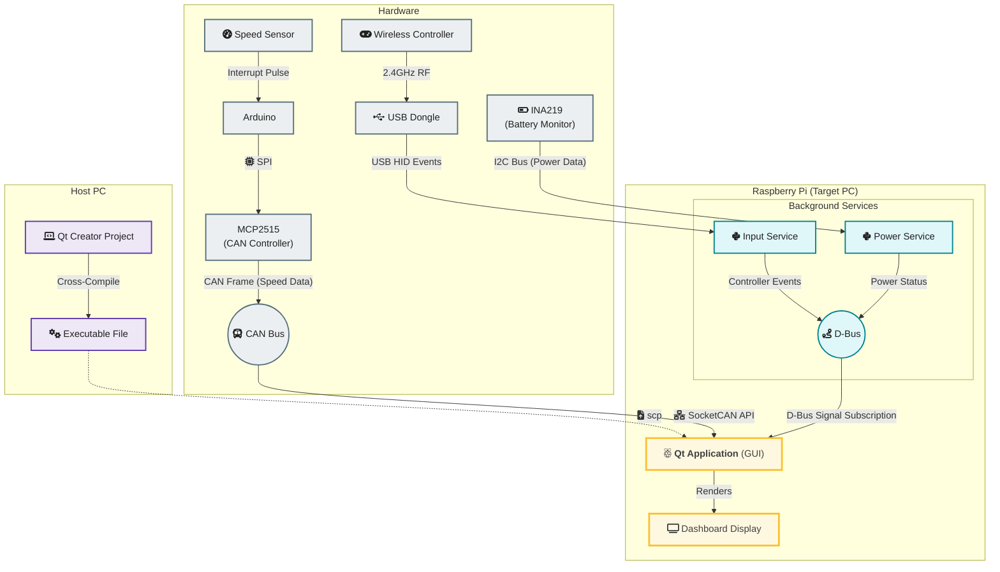
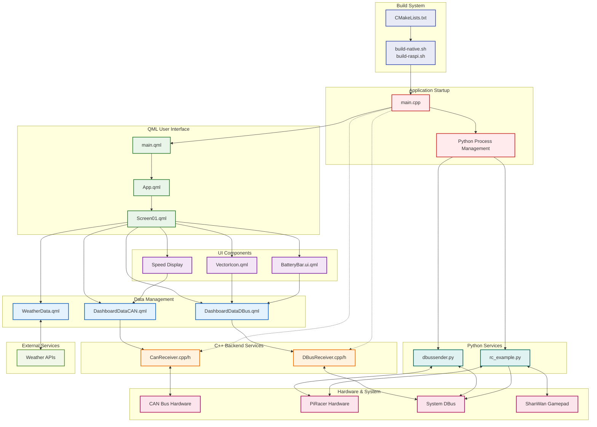

# DES Project - Instrument Cluster

## Introduction
The Instrument Cluster is a project that displays real-time vehicle data on a digital dashboard, utilizing a Raspberry Pi for processing and visualization.

Speed data is transmitted to the Raspberry Pi directly via the CAN bus. Concurrently, battery-related data is received via I2C communication and then integrated with the graphical user interface (GUI) through the D-Bus messaging system. The entire GUI was developed as a Qt application to ensure a responsive and real-time display.

## Features

### 🚗 Core Dashboard Functionality
- **Real-time Speed Display**: Shows vehicle speed in cm/s with smooth animations
- **RPM Monitoring**: Engine RPM display
- **CAN Integration**: Reads real vehicle data from CAN interface
- **One Euro Filtering**: Advanced signal smoothing for stable speed/RPM readings
- **Turn Signal Indicators**: Interactive left/right turn signal controls

### 🔋 Battery & Power Management
- **Battery Level Display**: Visual battery bar with color-coded states (critical, low, medium, normal)
- **Charging Status**: Real-time charging current monitoring via DBus
- **Charging Indicator**: Visual charging icon when current exceeds threshold (>100mA)

### 🌤️ Weather Integration
- **Real-time Weather**: Current temperature and weather conditions
- **Location Detection**: IP-based geolocation with GPS fallback
- **Weather Icons**: Dynamic weather icons based on current conditions

### 🎮 Input & Control
- **Gamepad Support**: ShanWan gamepad integration for PiRacer control

### 📡 Communication
- **CAN Support**: Linux SocketCAN integration for real vehicle data
- **DBus Interface**: Communication with PiRacer services

## Architecture

### System Architecture



### Full-Stack Software Architecture


### Data Flow
1. **CAN**: `can_new.ino` → `canreceiver.cpp` → `DashboardDataCAN.qml` → `Screen01.qml`
2. **DBus**: `dbussender.py` → `dbusreceiver.cpp` → `DashboardDataDBus.qml` → `Screen01.qml`
3. **Weather**: `WeatherData.qml` → `Screen01.qml`
4. **Filtering**: Raw data → One Euro Filter → Smooth animations

## Technology Stack

### Frontend
- **Qt 6.4+**: Modern Qt framework
- **QML**: Declarative UI language
- **Qt Quick Controls**: UI components
- **Qt Positioning**: Location services

### Backend
- **C++**: Core application logic
- **Linux SocketCAN**: CAN communication
- **DBus**: Inter-process communication (DBus)
- **Python**: PiRacer gamepad control

### Hardware Integration
- **CAN Interface**: `can10` interface for vehicle data
- **ShanWan Gamepad**: Vehicle control input

## Signal Processing

### One Euro Filter
The application implements a sophisticated One Euro Filter for signal smoothing:

- **Adaptive Filtering**: Adjusts smoothing based on signal velocity
- **Configurable Parameters**:
  - `minCutoff`: 1.0 Hz (baseline smoothing)
  - `beta`: 0.1 (adaptation sensitivity)
  - `derivateCutoff`: 1.0 Hz (derivative smoothing)
- **Dual Channel**: Separate filtering for speed and RPM
- **Real-time Processing**: 10Hz sampling rate

### Data Validation
- **RPM Threshold**: Values below 50 RPM treated as zero
- **Connection Monitoring**: Real-time CAN/DBus connection status
- **Error Handling**: Graceful fallback to simulation mode

## User Interface

### Dashboard Layout
- **Central Speed Display**: Large, prominent speed reading
- **RPM Indicator**: Side-mounted RPM display
- **Battery Bar**: Bottom-mounted battery level indicator
- **Weather Widget**: Top-right weather and time display
- **Status Indicators**: CAN connection and charging status

### Visual Design
- **Dark Theme**
- **Color Coding**:
  - Green (#00FF00): Normal status, turn signals
  - Red (#F44336): Critical battery level
  - Orange (#FF9800): Low battery warning
  - Yellow (#FFEB3B): Medium battery level
- **Smooth Animations**: 300-400ms transitions
- **Responsive Layout**: Scales for different screen sizes

### Interactive Elements
- **Turn Signals**: Pressing the L1 and R1 buttons on the controller activates the left and right turn signals, respectively. The signal is deactivated by either pressing the same button again or by steering in the opposite direction.
- **Battery Monitoring**: Real-time charging status display

## Configuration Files

### CAN Bus Setup
```cpp
// CAN interface configuration
const QString interface = "can10";
// Message ID for speed/RPM data
const uint32_t CAN_ID = 0x123;
```

### DBus Service
```cpp
// DBus service configuration
Service: "org.team7.IC"
Path: "/CarInformation"
Interface: "org.team7.IC.Interface"
```

### Weather API
```javascript
// Open-Meteo API configuration
Base URL: "http://api.open-meteo.com/v1/forecast"
Parameters: temperature_2m, weather_code, is_day
Location: IP-based geolocation with GPS fallback
```

## Data Formats

### CAN Message Format
```
ID: 0x123 (8 bytes)
[0-1]: Speed integer (big-endian)
[2]:   Speed fraction (0-99)
[3-4]: RPM integer (big-endian)  
[5]:   RPM fraction (0-99)
[6-7]: Reserved
```

### DBus Message Format
```json
{
    "battery_capacity": 85.5,
    "charging_current": 1250.0,
    "left_turn_signal": false,
    "right_turn_signal": true
}
```


## License

This project is licensed under the Qt Commercial License or GPL-3.0. See individual file headers for specific licensing information.

## Credits

Developed for the PiRacer platform using Qt Design Studio and Qt Creator. Weather data provided by Open-Meteo API.
